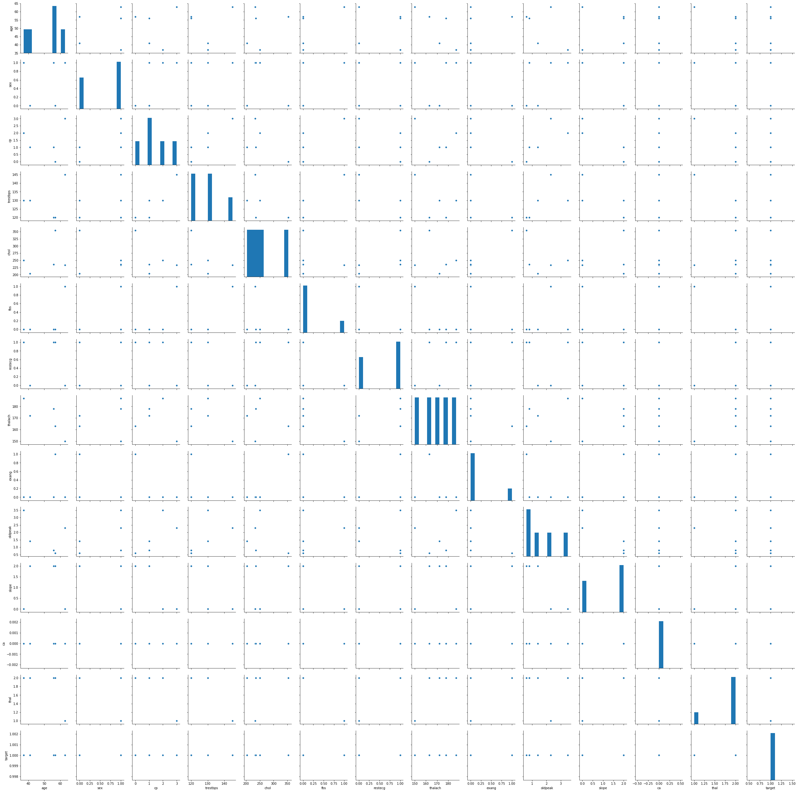
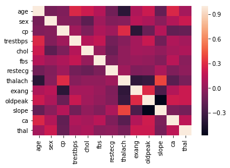
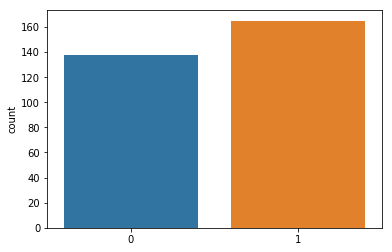

```python
import numpy as np
import matplotlib.pyplot as plt
%matplotlib inline
import pandas as pd
import seaborn as sns
from IPython.display import display
plt.rc('font', family='Verdana')
```


```python
df = pd.read_csv('/home/shashy/Загрузки/heart-disease-uci/heart.csv')
df.head()
```


<div>
<style scoped>
    .dataframe tbody tr th:only-of-type {
        vertical-align: middle;
    }

    .dataframe tbody tr th {
        vertical-align: top;
    }

    .dataframe thead th {
        text-align: right;
    }
</style>
<table border="1" class="dataframe">
  <thead>
    <tr style="text-align: right;">
      <th></th>
      <th>age</th>
      <th>sex</th>
      <th>cp</th>
      <th>trestbps</th>
      <th>chol</th>
      <th>fbs</th>
      <th>restecg</th>
      <th>thalach</th>
      <th>exang</th>
      <th>oldpeak</th>
      <th>slope</th>
      <th>ca</th>
      <th>thal</th>
      <th>target</th>
    </tr>
  </thead>
  <tbody>
    <tr>
      <th>0</th>
      <td>63</td>
      <td>1</td>
      <td>3</td>
      <td>145</td>
      <td>233</td>
      <td>1</td>
      <td>0</td>
      <td>150</td>
      <td>0</td>
      <td>2.3</td>
      <td>0</td>
      <td>0</td>
      <td>1</td>
      <td>1</td>
    </tr>
    <tr>
      <th>1</th>
      <td>37</td>
      <td>1</td>
      <td>2</td>
      <td>130</td>
      <td>250</td>
      <td>0</td>
      <td>1</td>
      <td>187</td>
      <td>0</td>
      <td>3.5</td>
      <td>0</td>
      <td>0</td>
      <td>2</td>
      <td>1</td>
    </tr>
    <tr>
      <th>2</th>
      <td>41</td>
      <td>0</td>
      <td>1</td>
      <td>130</td>
      <td>204</td>
      <td>0</td>
      <td>0</td>
      <td>172</td>
      <td>0</td>
      <td>1.4</td>
      <td>2</td>
      <td>0</td>
      <td>2</td>
      <td>1</td>
    </tr>
    <tr>
      <th>3</th>
      <td>56</td>
      <td>1</td>
      <td>1</td>
      <td>120</td>
      <td>236</td>
      <td>0</td>
      <td>1</td>
      <td>178</td>
      <td>0</td>
      <td>0.8</td>
      <td>2</td>
      <td>0</td>
      <td>2</td>
      <td>1</td>
    </tr>
    <tr>
      <th>4</th>
      <td>57</td>
      <td>0</td>
      <td>0</td>
      <td>120</td>
      <td>354</td>
      <td>0</td>
      <td>1</td>
      <td>163</td>
      <td>1</td>
      <td>0.6</td>
      <td>2</td>
      <td>0</td>
      <td>2</td>
      <td>1</td>
    </tr>
  </tbody>
</table>
</div>


```python
df.shape
```


    (303, 14)


```python
heatmap = df.drop('target', axis=1)
X_raw = df.drop('target', axis = 1).values
y = df['target'].values
```


```python
sns.pairplot(df.head())
```


    <seaborn.axisgrid.PairGrid at 0x7f77197c4a58>





```python
sns.heatmap(heatmap.corr())
```


    <matplotlib.axes._subplots.AxesSubplot at 0x7f7707ac66d8>





```python
sns.countplot(y)
```


    <matplotlib.axes._subplots.AxesSubplot at 0x7f7704900c88>





```python
from sklearn.model_selection import train_test_split
X_train, X_test, y_train, y_test = train_test_split(X_raw, y, random_state=0)
```


```python
print(X_train.shape, y_train.shape)
```

    (227, 13) (227,)


```python
from sklearn.linear_model import LogisticRegression
logreg = LogisticRegression(C=100000).fit(X_train, y_train)
```

    /home/shashy/anaconda3/lib/python3.7/site-packages/sklearn/linear_model/logistic.py:433: FutureWarning: Default solver will be changed to 'lbfgs' in 0.22. Specify a solver to silence this warning.
      FutureWarning)


```python
print("Точность предсказания на тестовом наборе на основе на Логистической регрессии c C=100000 составила: {:3f}".format(logreg.score(X_test, y_test)))
print("Точность предсказания на основе тренировочного набора на Логистической регрессии c C=100000 составила: {:3f}".format(logreg.score(X_train, y_train)))
```

    Точность предсказания на тестовом наборе на основе на Логистической регрессии c C=100000 составила: 0.828947
    Точность предсказания на основе тренировочного набора на Логистической регрессии c C=100000 составила: 0.850220


```python
from sklearn.svm import LinearSVC
svc = LinearSVC(C=100000).fit(X_train, y_train)
```

    /home/shashy/anaconda3/lib/python3.7/site-packages/sklearn/svm/base.py:931: ConvergenceWarning: Liblinear failed to converge, increase the number of iterations.
      "the number of iterations.", ConvergenceWarning)


```python
print("Точность предсказания на тестовом наборе на основе линейного метода опорных векторов с C=100000 составила: {:3f}".format(svc.score(X_test, y_test)))
print("Точность предсказания на основе тренировочного набора на основе линейного метода опорных векторов с C=100000 составила: {:3f}".format(svc.score(X_train, y_train)))
```

    Точность предсказания на тестовом наборе на основе линейного метода опорных векторов с C=100000 составила: 0.565789
    Точность предсказания на основе тренировочного набора на основе линейного метода опорных векторов с C=100000 составила: 0.594714


```python

```
